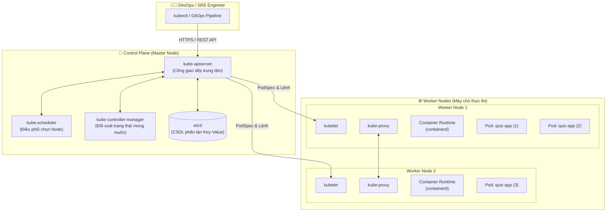

# 🚀 DevOps & Kubernetes Mastery: Enterprise Practical Handbook

[](https://kubernetes.io/)
[](https://www.docker.com/)
[](https://minikube.sigs.k8s.io/)
[](https://microsoft.com/powershell)
[](LICENSE)

> Kho tài liệu và bộ mã nguồn cấu hình thực chiến (Declarative Manifests & Cheatsheet) dành cho Kỹ sư DevOps, SRE và Lập trình viên từ cơ bản đến nâng cao theo chuẩn doanh nghiệp.

---

## 📑 Mục Lục
- [1. Cấu Trúc Thư Mục Kho Lưu Trữ](#1-cấu-trúc-thư-mục-kho-lưu-trữ)
- [2. Kiến Trúc Cụm Kubernetes Tổng Quát](#2-kiến-trúc-cụm-kubernetes-tổng-quát)
- [3. Chuỗi Phụ Thuộc Manifests (Enterprise Standard)](#3-chuỗi-phụ-thuộc-manifests-enterprise-standard)
- [4. Hướng Dẫn Bắt Đầu Nhanh (Quickstart 3 Bước)](#4-hướng-dẫn-bắt-đầu-nhanh-quickstart-3-bước)
- [5. Hệ Thống Tài Liệu Chi Tiết](#5-hệ-thống-tài-liệu-chi-tiết)
- [6. Bảng Tra Cứu Câu Lệnh Thường Dùng](#6-bảng-tra-cứu-câu-lệnh-thường-dùng)

---

## 1. Cấu Trúc Thư Mục Kho Lưu Trữ

```text
d:\DevOps\
├── 📂 k8s-manifests/               # Bộ manifests hoàn chỉnh chuẩn doanh nghiệp
│   ├── 00-namespace.yaml          # Phân vùng không gian tài nguyên cô lập (quiz-app)
│   ├── 01-configmap.yaml          # Quản lý biến môi trường, cấu hình không nhạy cảm
│   ├── 02-secret.yaml             # Bảo mật mật khẩu, API keys (Base64)
│   ├── 03-deployment.yaml         # Vòng đời Pods, Rolling Update, Resources limit/request
│   ├── 04-service.yaml            # Cố định địa chỉ mạng nội bộ và cân bằng tải Pods
│   ├── 05-ingress.yaml            # Định tuyến tên miền HTTP/HTTPS (quiz-app.com)
│   ├── 06-hpa.yaml                # Tự động co giãn số lượng Pods theo tải CPU (HPA)
│   └── README.md                  # Hướng dẫn chi tiết vận hành bộ manifests
├── 📄 cac_lenh_devops.md          # Sổ tay tổng hợp toàn bộ câu lệnh DevOps, Docker & K8s
├── 📄 k8s.md                      # Giáo trình chuyên sâu kiến trúc và lý thuyết Kubernetes
├── 📄 k8s.txt                     # Bản ghi chép tóm tắt nhanh kiến trúc & lệnh kubectl
├── 📄 demo-app.yaml               # Manifest mẫu all-in-one cơ bản cho người mới
└── 📄 README.md                   # Tài liệu tổng quan (Root Documentation)
```

---

## 2. Kiến Trúc Cụm Kubernetes Tổng Quát



---

## 3. Chuỗi Phụ Thuộc Manifests (Enterprise Standard)

Trong môi trường thực tế, việc triển khai ứng dụng tuân thủ nghiêm ngặt **Dependency Chain (Chuỗi phụ thuộc)**:

```
[00-namespace.yaml]     --> 1. Tạo PHÂN VÙNG TÀI NGUYÊN cô lập (quiz-app)
        │
        ▼
[01-configmap.yaml]     --> 2. Chuẩn bị CẤU HÌNH BIẾN MÔI TRƯỜNG (PORT, APP_ENV)
[02-secret.yaml]        --> 3. Chuẩn bị MẬT KHẨU / KHÓA BẢO MẬT (DB_PASSWORD)
        │
        ▼
[03-deployment.yaml]    --> 4. Khởi động ỨNG DỤNG PODS (Tự động nạp ConfigMap & Secret)
        │
        ▼
[04-service.yaml]       --> 5. Cấp PHÁT IP ỔN ĐỊNH & CÂN BẰNG TẢI nội bộ cụm
        │
        ▼
[05-ingress.yaml]       --> 6. ĐỊNH TUYẾN TÊN MIỀN TẦNG 7 (quiz-app.com -> Service)
        │
        ▼
[06-hpa.yaml]           --> 7. TỰ ĐỘNG CO GIÃN PODS (Tự tăng từ 2 -> 10 Pods khi CPU > 70%)
```

---

## 4. Hướng Dẫn Bắt Đầu Nhanh (Quickstart 3 Bước)

### 🔹 Bước 1: Khởi động cụm Minikube Local
Mở PowerShell (quyền Administrator):
```powershell
# Khởi chạy cụm 2 nodes (1 Master + 1 Worker)
minikube start --nodes 2 --driver=docker --cpus 4 --memory 8192

# Bật Ingress và Metrics Server (để đo tải CPU cho HPA)
minikube addons enable ingress
minikube addons enable metrics-server
```

### 🔹 Bước 2: Triển khai toàn bộ ứng dụng chỉ bằng 1 câu lệnh
```powershell
kubectl apply -f ./k8s-manifests/
```

### 🔹 Bước 3: Kiểm tra trạng thái & Trải nghiệm
```powershell
# 1. Xem tất cả tài nguyên trong namespace quiz-app
kubectl get all -n quiz-app

# 2. Xem Ingress & HPA
kubectl get ingress,hpa -n quiz-app

# 3. Mở Ingress Tunnel (trên 1 tab Terminal riêng)
minikube tunnel
```
> 💡 Thêm `127.0.0.1 quiz-app.com` vào file `C:\Windows\System32\drivers\etc\hosts` và truy cập trình duyệt tại `http://quiz-app.com`.

---

## 5. Hệ Thống Tài Liệu Chi Tiết

| Tài liệu | Mô tả nội dung chính |
| :--- | :--- |
| 📖 [**`k8s.md`**](file:///d:/DevOps/k8s.md) | Giáo trình chuyên sâu đầy đủ: Control Plane, Worker Node, Pods Lifecycle, Service Types, Ingress NGINX, HPA, PV/PVC Storage, Helm, GitOps. |
| ⚡ [**`cac_lenh_devops.md`**](file:///d:/DevOps/cac_lenh_devops.md) | Bảng tra cứu 10 nhóm câu lệnh DevOps thực chiến: Kiểm tra phần cứng, quản lý Docker, dọn dẹp dung lượng, gỡ lỗi container (exec/logs), mở tunnel ra Internet. |
| 🏗️ [**`k8s-manifests/README.md`**](file:///d:/DevOps/k8s-manifests/README.md) | Hướng dẫn chi tiết nguyên lý thiết kế và vận hành từng file YAML chuẩn Enterprise. |
| 📝 [**`k8s.txt`**](file:///d:/DevOps/k8s.txt) | Ghi chú nhanh các khái niệm cốt lõi phục vụ ôn tập và tra cứu nhanh. |

---

## 6. Bảng Tra Cứu Câu Lệnh Thường Dùng

### 🩺 Giám sát & Gỡ lỗi (Troubleshooting)
```powershell
# Xem log thời gian thực của Pod
kubectl logs -f <ten-pod> -n quiz-app

# Truy cập dòng lệnh bên trong Pod
kubectl exec -it <ten-pod> -n quiz-app -- /bin/sh

# Xem chi tiết sự kiện và lỗi (CrashLoopBackOff, ImagePullBackOff,...)
kubectl describe pod <ten-pod> -n quiz-app

# Kiểm tra mức tiêu thụ CPU & RAM của cụm
kubectl top nodes
kubectl top pods -n quiz-app
```

### 🧹 Dọn dẹp môi trường (Cleanup)
```powershell
# Cách 1: Xóa toàn bộ tài nguyên theo bộ manifests
kubectl delete -f ./k8s-manifests/

# Cách 2: Xóa sạch toàn bộ Namespace (nhanh nhất)
kubectl delete namespace quiz-app

# Tắt và giải phóng RAM cụm Minikube
minikube stop
```

---

<div align="center">
  <sub>Được xây dựng và đóng góp bởi <b>Kỹ sư DevOps</b> | Cập nhật định kỳ theo chuẩn Kubernetes mới nhất.</sub>
</div>
